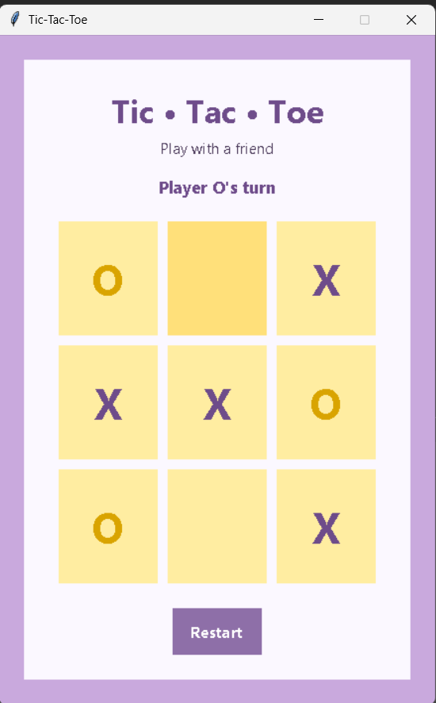

# 🎮 Tic-Tac-Toe (X & O)

A simple, colorful two-player Tic-Tac-Toe game built with Python and `tkinter` - purple & yellow theme, clean UI, basic logic.

Take turns placing ❌ and ⭕ on the board - first to line up three in a row, column, or diagonal wins!

## 📸 Screenshot



## ✨ Features

- 🕹️ Two-player local gameplay (X vs O)
- 🏆 Win and tie detection
- 🔄 One-click restart
- 🎨 Purple & yellow theme with a clean font
- 🧩 Backend logic and UI split into separate files

## 🛠️ Requirements

- Python 3.x (`tkinter` ships with standard Python installations - no extra installs needed)

## ▶️ How to Run

```bash
python ui.py
```

## 📂 Project Structure

```
tic-tac-toe-game/
├── game_logic.py   🧠 backend - board state, moves, win/tie checking
├── ui.py           🎨 frontend - window, colors, buttons (run this file)
├── x&0.png         📸 screenshot
└── README.md
```
